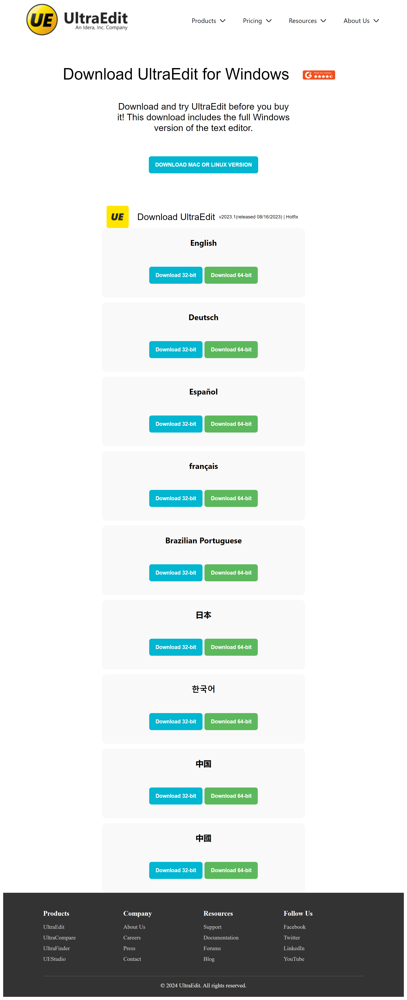

<h1>Website using html and css grid and flexbox.</h1>
<h2>About Website </h2>
<ul>
    <li>Built with HTML and CSS</li>
    <li>The website features a logo and a header with 4 main pages: Products, Pricing, Resources, and About Us.</li>
    <li>The main section has download buttons for UltraEdit in different languages, organized with flex and grid layou<li>
    <li>Various hover effects are used to enhance interactivity.</li>
    <li>The footer includes links to products, company information, resources, and social media<li>
    <li>Built with HTML and CSS</li>
</ul>
